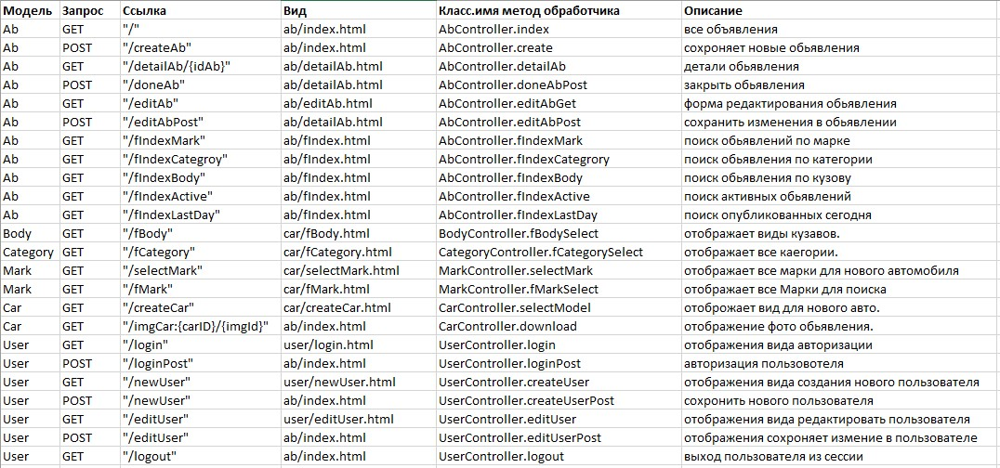
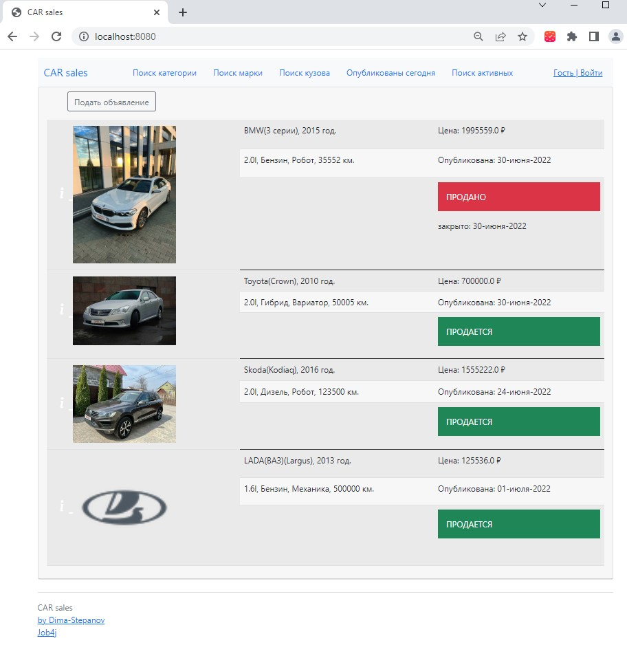
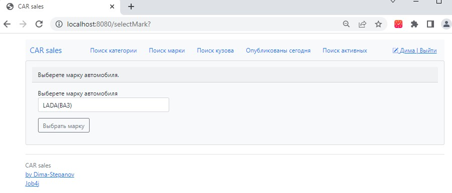
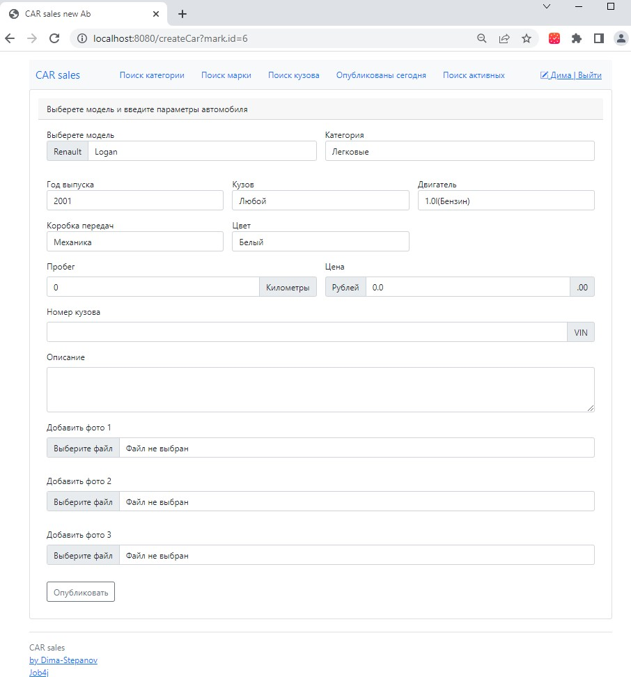
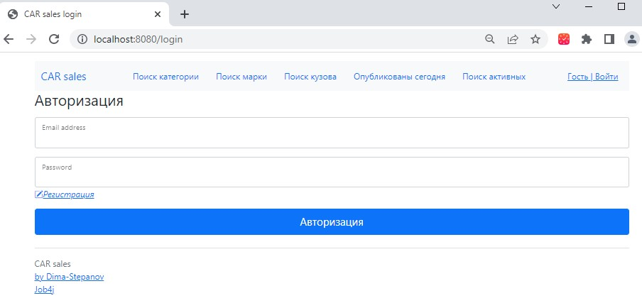
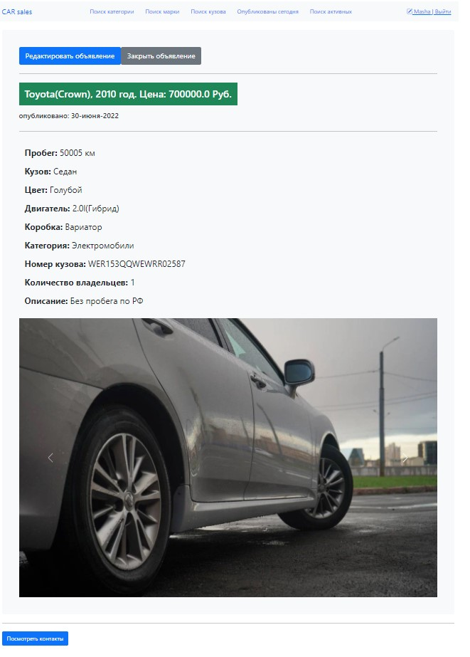
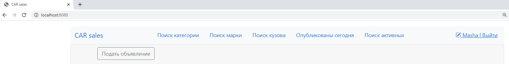
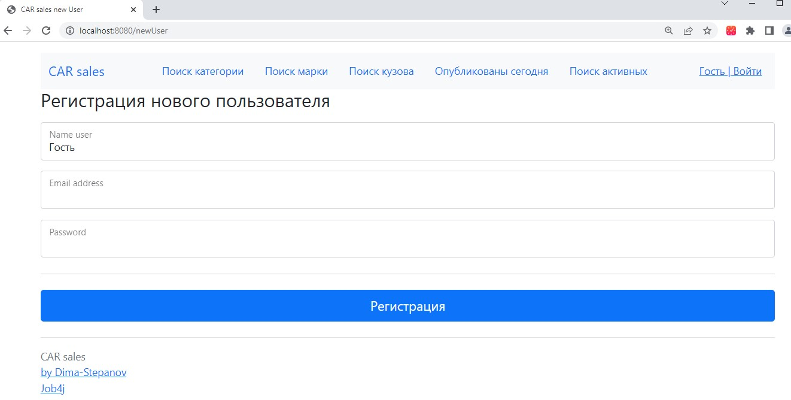
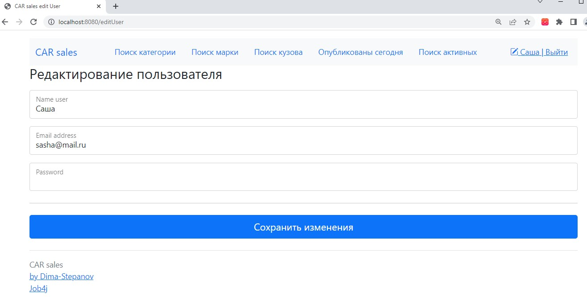

<h1>Проект job4j_cars</h1> 
<h2>Реализацие площадки машин.</h2> 

<h6>Опсиание:</h6> 
Проект содержит базу данных cars_db.
Схема таблиц базы данных:  

  

Между таблицами categories, models, marks, years, bodies, users, abs, cars,  
drivers, engines, transmissions, colors, history_owner,  
возникают следующие связи:  
Many to One  
Models -1-> Marks  
Photo -1-> Cars  
Cars -1-> Engines  
Cars -1-> Bodies  
Cars -1-> Category  
Cars -1-> Transmissions  
Cars -1-> Models  
Cars -1-> Colors  
Cars -1-> Years  
Abs -1-> Cars  
Abs -1-> Users  
Many to Many  
CarsHistory_ownerDriver  

<b>Реализованы 13 модели данных:</b> 
Body - описывает кузов автомобиля, одна из характеристик Car.  
Category - описывает категорию автомобиля, одна из характеристик Car.  
Color - цвет автомобиля, одна из характеристик Car.  
Driver - описывает владельца автомобиля, одна из характеристик Car.  
Engine - описывает двигатель автомобиля, одна из характеристик Car.  
Mark - описывает марку автомобиля, составляет Model.  
Model - описывает модель автомобиля, одна из характеристик Car.  
Photo - описывает модель фото автомобиля, одна из характеристик Car.  
Transmission - описывает модель трансмиссию автомобиля, одна из характеристик Car.  
Year - описывает модель год выпуска авто, одна из характеристик Car.  
Car - описывает характеристики автомобиля. 
User - описывает автора обьявления.  
Ab - описывает модель самого обьявления.  

В моделях данных организован mapping данных к таблицам базы данных cars_db:  
Справочники: bodies.sql, categories.sql, colors.sql, engines.sql, marks.sql,  
models.sql, transmissions.sql, years.sql, drivers.sql, engines.sql, history_owner.sql.  
Основные таблицы: cars.sql, users.sql, abs.sql drivers.sql.  

<b>MVC модель приложения и зависимости между формами и запросами. </b>

  

<h3>Основная страница. таблица со всеми объявлениям машин на продажу.</h3>
На странице присутствует кнопка добавить новое объявление.  

  

<h3>Переходить на страницу добавления. </h3>
Открывается вид выбора марки авто.  

  

Далее отображается форма дял добавления нового объявления, различные характеристики и до 3-х фото.  

  

После добавления объявления осуществляется переход на главную страницу со всеми объявлениями

Добавление нового объявления разрешено только авторизованным пользователям.  
Если пользователь не авторизован клиент перенаправляется на страницу авторизации.  

  

<h3>Объявление имеет статус продано. или нет.</h3>

<h3>При нажатии на фото можно просмотреть детали объявления </h3>
При этом авторизованному создателю объявления доступны редактирование и закрытие объявления. 
На виде подробного описания объявления отображается несколько картинок в виде карусели.  

  

<h3>Фильтры для поиска </h3>
В панели навигации расположены кнопки для фильтрации поиска объявлений.  
Возможно отфильтровать объявления по категории, по марке авто, по типу кузова,  
опубликованные сегодня, поиск активных объявлений.  

  

<h3>Для пользователей</h3>
Для пользователей есть возможность авторизоваться, покинуть сессию, изменить учетные данные,  
и зарегистрироваться новому пользователя.  

Вид для нового пользователя  

  

Вид для редактирования пользователя  

  

### Контакты

> email: [haoos@inbox.ru](mailto:haoos@inbox.ru)  
> tl: [Dima_software](https://t.me/Dima_software)  
> github.com: [Dima-Stepanov](https://github.com/Dima-Stepanov)

