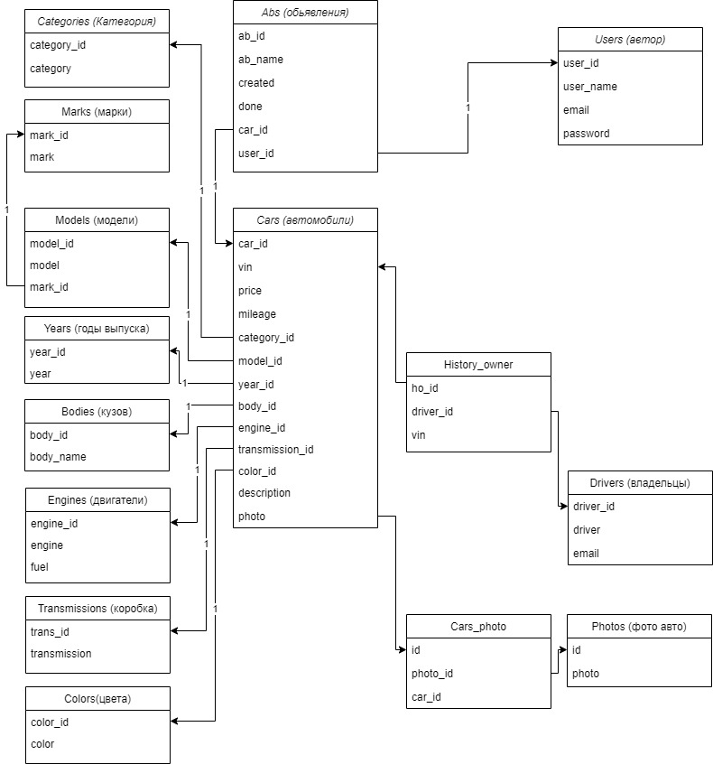

<h1>Проект job4j_cars</h1> 
<h2>Реализацие площадки машин.</h2> 

<h6>Опсиание:</h6> 
Проект содержит базу данных cars_db.
Схема таблиц базы данных:  
  

Между таблицами cars, drivers, engines, history_owner,  
возникают следующие связи:  
One to One  
Cars -1->Engines  
Many to Many  
CarsHistory_ownerDriver  

<b>Реализованы 3 модели данных:</b> 
Car - описывает характеристики автомобиля. 
Driver - описывает владельца автомобиля, одна из характеристик Car.  
Engine - описывает двигатель автомобиля, одна из характеристик Car.  

В моделях данных организован mapping данных к таблицам базы данных cars_db:  
cars.sql, drivers.sql, engines.sql, history_owner.sql.  